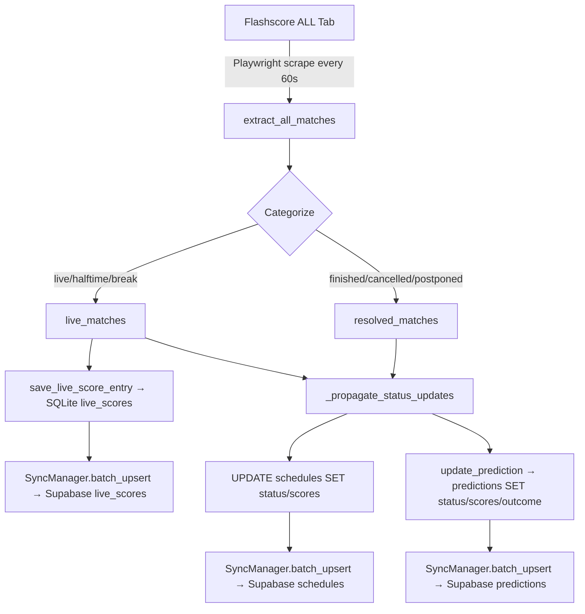
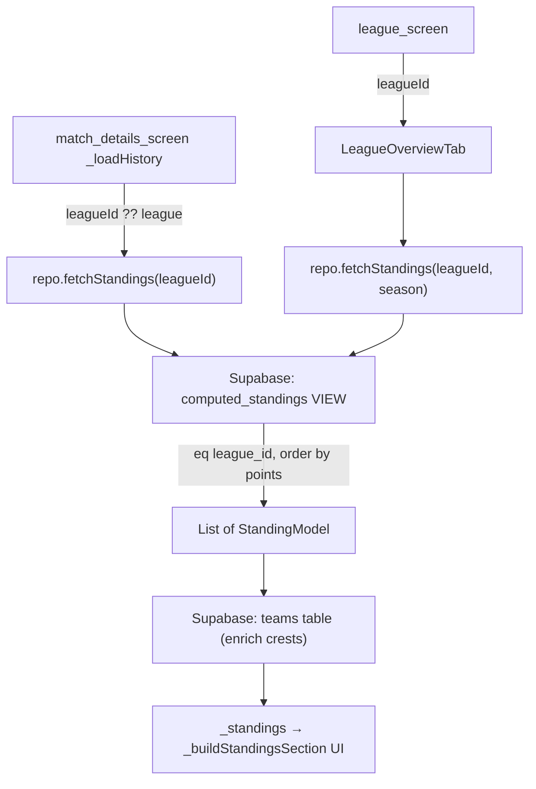
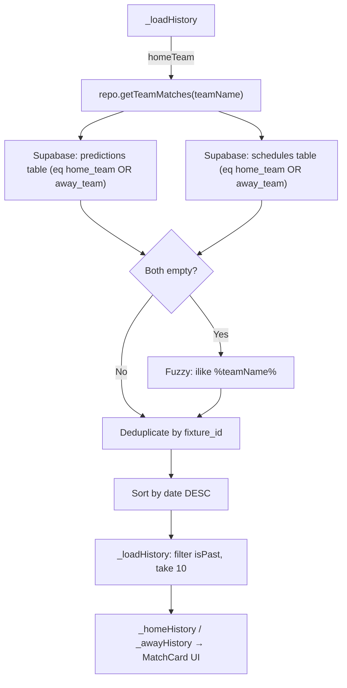
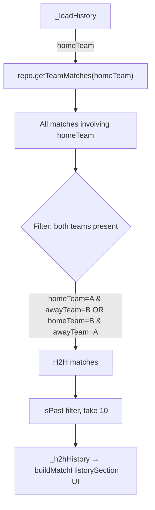
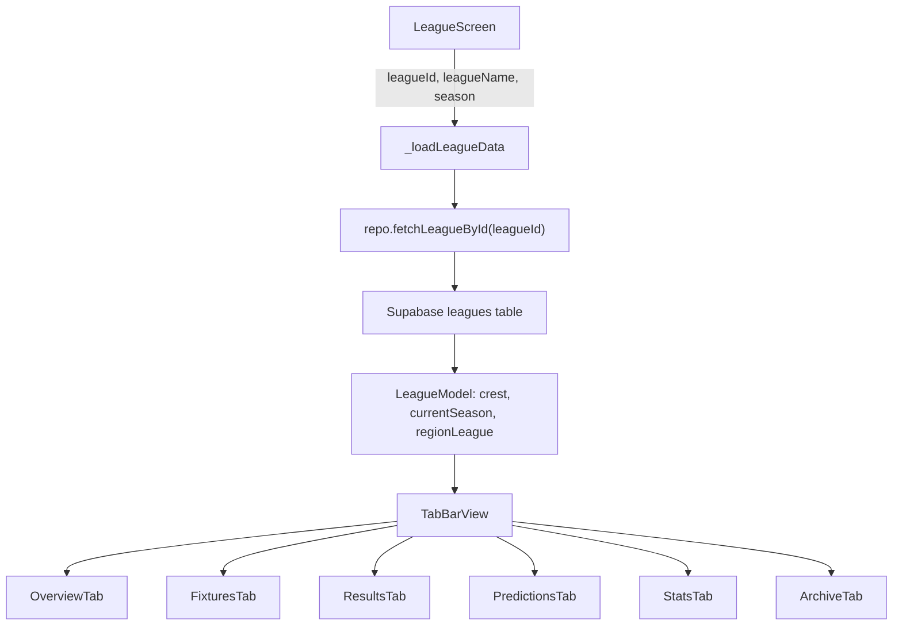

# Evidence-Based Flow Report: Live Streamer, Standings, Match History & H2H

## 1. Live Score Streamer ([fs_live_streamer.py](file:///c:/Users/Admin/Desktop/ProProjection/LeoBook/Modules/Flashscore/fs_live_streamer.py))

### Data Flow

### Step-by-Step Execution

| Step | Who | What | Evidence |
|------|-----|------|----------|
| 1 | [live_score_streamer()](file:///c:/Users/Admin/Desktop/ProProjection/LeoBook/Modules/Flashscore/fs_live_streamer.py#510-656) | Launches headless Chromium (iPhone 12 emulation), navigates to `flashscore.com/football/` | [L510-550](file:///c:/Users/Admin/Desktop/ProProjection/LeoBook/Modules/Flashscore/fs_live_streamer.py#L510-L550) |
| 2 | [_catch_up_from_live_stream()](file:///c:/Users/Admin/Desktop/ProProjection/LeoBook/Modules/Flashscore/fs_live_streamer.py#409-508) | On first cycle only: checks [live_scores](file:///c:/Users/Admin/Desktop/ProProjection/LeoBook/Modules/Flashscore/fs_live_streamer.py#304-332) for unresolved entries. If ≤7 days behind, navigates day-by-day backward then forward, extracting each day. If >7 days, falls back to `Leo.py --enrich-leagues --refresh` subprocess | [L409-507](file:///c:/Users/Admin/Desktop/ProProjection/LeoBook/Modules/Flashscore/fs_live_streamer.py#L409-L507) |
| 3 | `extract_all_matches()` | Scrapes DOM for all visible match rows, returns list of dicts with `fixture_id`, `home_team`, `away_team`, `home_score`, `away_score`, [status](file:///c:/Users/Admin/Desktop/ProProjection/LeoBook/Modules/Flashscore/fs_live_streamer.py#114-258), [date](file:///c:/Users/Admin/Desktop/ProProjection/LeoBook/leobookapp/lib/logic/cubit/home_cubit.dart#377-489), [time](file:///c:/Users/Admin/Desktop/ProProjection/LeoBook/leobookapp/lib/logic/cubit/home_cubit.dart#312-376) | [L578](file:///c:/Users/Admin/Desktop/ProProjection/LeoBook/Modules/Flashscore/fs_live_streamer.py#L578) (imported from [fs_extractor.py](file:///c:/Users/Admin/Desktop/ProProjection/LeoBook/Modules/Flashscore/fs_extractor.py)) |
| 4 | Main loop | Splits matches into `live_matches` (status ∈ {live, halftime, break, penalties, extra_time}) and `resolved_matches` (status ∈ {finished, cancelled, postponed, fro, abandoned}) | [L580-586](file:///c:/Users/Admin/Desktop/ProProjection/LeoBook/Modules/Flashscore/fs_live_streamer.py#L580-L586) |
| 5 | [_purge_stale_live_scores()](file:///c:/Users/Admin/Desktop/ProProjection/LeoBook/Modules/Flashscore/fs_live_streamer.py#304-332) | Tracks fixtures missing from live stream for 3+ consecutive cycles, deletes them from [live_scores](file:///c:/Users/Admin/Desktop/ProProjection/LeoBook/Modules/Flashscore/fs_live_streamer.py#304-332) table. Also purges resolved fixtures. | [L304-331](file:///c:/Users/Admin/Desktop/ProProjection/LeoBook/Modules/Flashscore/fs_live_streamer.py#L304-L331) |
| 6 | `save_live_score_entry()` | Upserts each live match into SQLite [live_scores](file:///c:/Users/Admin/Desktop/ProProjection/LeoBook/Modules/Flashscore/fs_live_streamer.py#304-332) table | [L598-599](file:///c:/Users/Admin/Desktop/ProProjection/LeoBook/Modules/Flashscore/fs_live_streamer.py#L598-L599) (from [db_helpers.py](file:///c:/Users/Admin/Desktop/ProProjection/LeoBook/Data/Access/db_helpers.py)) |
| 7 | [_propagate_status_updates()](file:///c:/Users/Admin/Desktop/ProProjection/LeoBook/Modules/Flashscore/fs_live_streamer.py#114-258) | **Schedules**: Updates `match_status`, `home_score`, `away_score` in `schedules` table for all live/resolved fixtures. Adds new fixtures not yet in schedules via `transform_streamer_match_to_schedule()`. **Predictions**: Updates [status](file:///c:/Users/Admin/Desktop/ProProjection/LeoBook/Modules/Flashscore/fs_live_streamer.py#114-258), scores, and calls `evaluate_market_outcome()` for resolved predictions | [L114-257](file:///c:/Users/Admin/Desktop/ProProjection/LeoBook/Modules/Flashscore/fs_live_streamer.py#L114-L257) |
| 8 | Safety: 2.5hr rule | If a match has been "live" for >150 minutes, force-sets to "finished" (prevents stuck live matches) | [L159-164](file:///c:/Users/Admin/Desktop/ProProjection/LeoBook/Modules/Flashscore/fs_live_streamer.py#L159-L164) |
| 9 | Delta detection | Compares [(frozenset(live_ids), sched_count, pred_count)](file:///c:/Users/Admin/Desktop/ProProjection/LeoBook/Modules/Flashscore/fs_live_streamer.py#669-672) to previous cycle. Only pushes to Supabase if signature changed | [L606-621](file:///c:/Users/Admin/Desktop/ProProjection/LeoBook/Modules/Flashscore/fs_live_streamer.py#L606-L621) |
| 10 | [_review_pending_backlog()](file:///c:/Users/Admin/Desktop/ProProjection/LeoBook/Modules/Flashscore/fs_live_streamer.py#260-302) | Every 5th cycle: scans `predictions` for `status='pending'` entries and resolves them using finished `schedules` data | [L260-301](file:///c:/Users/Admin/Desktop/ProProjection/LeoBook/Modules/Flashscore/fs_live_streamer.py#L260-L301) |
| 11 | Browser recycling | After 3 cycles per session, closes and re-launches browser to prevent memory leaks | [L523, L571](file:///c:/Users/Admin/Desktop/ProProjection/LeoBook/Modules/Flashscore/fs_live_streamer.py#L523) |

### Guardrails & Checks

| Check | Location | Purpose |
|-------|----------|---------|
| Heartbeat file (PID + timestamp) | [L59-99](file:///c:/Users/Admin/Desktop/ProProjection/LeoBook/Modules/Flashscore/fs_live_streamer.py#L59-L99) | Prevents duplicate streamer instances; stale if >15 min |
| `NO_SCORE_STATUSES` guard | [L126](file:///c:/Users/Admin/Desktop/ProProjection/LeoBook/Modules/Flashscore/fs_live_streamer.py#L126) | Clears scores for cancelled/postponed (don't record 0-0) |
| `_missed_cycles` counter | [L317-320](file:///c:/Users/Admin/Desktop/ProProjection/LeoBook/Modules/Flashscore/fs_live_streamer.py#L317-L320) | 3-strike purge: fixture must be missing for 3 consecutive cycles before deletion |
| `@aigo_retry(max_retries=2)` | [L510](file:///c:/Users/Admin/Desktop/ProProjection/LeoBook/Modules/Flashscore/fs_live_streamer.py#L510) | Retries entire streamer function on crash |
| Browser crash detection | [L635-637](file:///c:/Users/Admin/Desktop/ProProjection/LeoBook/Modules/Flashscore/fs_live_streamer.py#L635-L637) | "Target crashed" → break inner loop → recycle browser |

### Output Consumers

| Consumer | Data | Channel |
|----------|------|---------|
| Flutter [watchLiveScores()](file:///c:/Users/Admin/Desktop/ProProjection/LeoBook/leobookapp/lib/data/repositories/data_repository.dart#355-359) | [live_scores](file:///c:/Users/Admin/Desktop/ProProjection/LeoBook/Modules/Flashscore/fs_live_streamer.py#304-332) table | Supabase Realtime stream |
| Flutter [watchPredictions()](file:///c:/Users/Admin/Desktop/ProProjection/LeoBook/leobookapp/lib/data/repositories/data_repository.dart#360-374) | `predictions` table | Supabase Realtime stream |
| Flutter [watchSchedules()](file:///c:/Users/Admin/Desktop/ProProjection/LeoBook/leobookapp/lib/data/repositories/data_repository.dart#375-389) | `schedules` table | Supabase Realtime stream |
| `HomeCubit._periodicRefresh()` | `schedules` (now) | REST query every 3s |

---

## 2. League Standings

### Data Flow

### Step-by-Step

| Step | Who | What | Evidence |
|------|-----|------|----------|
| 1 | `_MatchDetailsScreenState.initState()` | Calls [_loadHistory()](file:///c:/Users/Admin/Desktop/ProProjection/LeoBook/leobookapp/lib/presentation/screens/match_details_screen.dart#48-98) on mount | [L43-46](file:///c:/Users/Admin/Desktop/ProProjection/LeoBook/leobookapp/lib/presentation/screens/match_details_screen.dart#L43-L46) |
| 2 | [_loadHistory()](file:///c:/Users/Admin/Desktop/ProProjection/LeoBook/leobookapp/lib/presentation/screens/match_details_screen.dart#48-98) | Calls `repo.fetchStandings(leagueId: match.leagueId ?? match.league!)` | [L56-60](file:///c:/Users/Admin/Desktop/ProProjection/LeoBook/leobookapp/lib/presentation/screens/match_details_screen.dart#L56-L60) |
| 3 | `DataRepository.fetchStandings()` | Queries Supabase `computed_standings` VIEW with `.eq('league_id', cleanId)`. If `season` is provided, filters by season too. Orders by `points DESC, goal_difference DESC` | [L220-244](file:///c:/Users/Admin/Desktop/ProProjection/LeoBook/leobookapp/lib/data/repositories/data_repository.dart#L220-L244) |
| 4 | Crest enrichment | Fetches `teams.name, teams.crest` for all team names in standings, merges crest URLs into [StandingModel](file:///c:/Users/Admin/Desktop/ProProjection/LeoBook/leobookapp/lib/data/models/standing_model.dart#6-65) objects | [L246-286](file:///c:/Users/Admin/Desktop/ProProjection/LeoBook/leobookapp/lib/data/repositories/data_repository.dart#L246-L286) |
| 5 | [_buildStandingsSection()](file:///c:/Users/Admin/Desktop/ProProjection/LeoBook/leobookapp/lib/presentation/screens/match_details_screen.dart#1061-1306) | Renders horizontal-scrollable table with position, team crest, name, MP, W, D, L, GF, GA, GD, Pts columns | [L1061-onward](file:///c:/Users/Admin/Desktop/ProProjection/LeoBook/leobookapp/lib/presentation/screens/match_details_screen.dart#L1061) |

### ⚠️ Issues Found

> [!WARNING]
> **Bug: [fetchStandings](file:///c:/Users/Admin/Desktop/ProProjection/LeoBook/leobookapp/lib/data/repositories/data_repository.dart#220-295) `cleanId` logic strips league name, not extracts ID**
> At [L224-227](file:///c:/Users/Admin/Desktop/ProProjection/LeoBook/leobookapp/lib/data/repositories/data_repository.dart#L224-L227), if `leagueId` contains `: `, it strips the region prefix and uses only the league name. But `computed_standings.league_id` expects the actual league ID string (e.g., `1_98_zoUKKmCO`), not the league name. This means standings queries using `match.league` (which is `country_league` format like "Albania: Abissnet Superiore") will produce the wrong `cleanId`.

> [!WARNING]
> **Bug: [_buildStandingsSection](file:///c:/Users/Admin/Desktop/ProProjection/LeoBook/leobookapp/lib/presentation/screens/match_details_screen.dart#1061-1306) passes `match.league` as `leagueId` to [LeagueScreen](file:///c:/Users/Admin/Desktop/ProProjection/LeoBook/leobookapp/lib/presentation/screens/league_screen.dart#18-33)**
> At [L1092](file:///c:/Users/Admin/Desktop/ProProjection/LeoBook/leobookapp/lib/presentation/screens/match_details_screen.dart#L1092), the "View League" tap uses `match.league ?? "LEAGUE"` as `leagueId` — this is the readable name ("Albania: Abissnet Superiore"), not the actual league ID. The [LeagueScreen](file:///c:/Users/Admin/Desktop/ProProjection/LeoBook/leobookapp/lib/presentation/screens/league_screen.dart#18-33) then passes this to [fetchStandings](file:///c:/Users/Admin/Desktop/ProProjection/LeoBook/leobookapp/lib/data/repositories/data_repository.dart#220-295), which queries `computed_standings.league_id` with a name string → returns no results.

> [!CAUTION]
> **`computed_standings` is a Supabase VIEW, not a real table.** It's computed from `schedules` data. It doesn't emit Supabase Realtime events natively. The [watchStandings()](file:///c:/Users/Admin/Desktop/ProProjection/LeoBook/leobookapp/lib/data/repositories/data_repository.dart#390-427) stream at [L390-410](file:///c:/Users/Admin/Desktop/ProProjection/LeoBook/leobookapp/lib/data/repositories/data_repository.dart#L390-L410) works around this by listening to `schedules` changes and re-fetching the view.

> [!NOTE]
> **No season filter in [_loadHistory](file:///c:/Users/Admin/Desktop/ProProjection/LeoBook/leobookapp/lib/presentation/screens/match_details_screen.dart#48-98) standings call.** At [L57-59](file:///c:/Users/Admin/Desktop/ProProjection/LeoBook/leobookapp/lib/presentation/screens/match_details_screen.dart#L57-59), [fetchStandings](file:///c:/Users/Admin/Desktop/ProProjection/LeoBook/leobookapp/lib/data/repositories/data_repository.dart#220-295) is called without `season:` parameter.  This means it returns standings from ALL seasons for that league. The previous user-reported bug about "standings table returns all seasons" is confirmed here.

---

## 3. Last Matches (Home Team History / Away Team History)

### Data Flow

### Step-by-Step

| Step | Who | What | Evidence |
|------|-----|------|----------|
| 1 | [_loadHistory()](file:///c:/Users/Admin/Desktop/ProProjection/LeoBook/leobookapp/lib/presentation/screens/match_details_screen.dart#48-98) | Calls `repo.getTeamMatches(match.homeTeam)` and `repo.getTeamMatches(match.awayTeam)` | [L51-52](file:///c:/Users/Admin/Desktop/ProProjection/LeoBook/leobookapp/lib/presentation/screens/match_details_screen.dart#L51-L52) |
| 2 | [getTeamMatches()](file:///c:/Users/Admin/Desktop/ProProjection/LeoBook/leobookapp/lib/data/repositories/data_repository.dart#100-177) | Runs **parallel** queries to both `predictions` AND `schedules` tables with exact team name match `.eq('home_team', teamName)` or `.eq('away_team', teamName)`. Limit 10 per table. | [L103-116](file:///c:/Users/Admin/Desktop/ProProjection/LeoBook/leobookapp/lib/data/repositories/data_repository.dart#L103-L116) |
| 3 | Fuzzy fallback | If both queries return empty, retries with `.ilike('%teamName%')` for partial matching | [L122-138](file:///c:/Users/Admin/Desktop/ProProjection/LeoBook/leobookapp/lib/data/repositories/data_repository.dart#L122-L138) |
| 4 | Deduplication | Combines predictions + schedules, deduplicates by `fixture_id` using a `Set<String>`. Predictions take priority (added first) | [L141-158](file:///c:/Users/Admin/Desktop/ProProjection/LeoBook/leobookapp/lib/data/repositories/data_repository.dart#L141-L158) |
| 5 | Date sort | Sorts merged list by `date DESC` | [L163-169](file:///c:/Users/Admin/Desktop/ProProjection/LeoBook/leobookapp/lib/data/repositories/data_repository.dart#L163-L169) |
| 6 | [isPast](file:///c:/Users/Admin/Desktop/ProProjection/LeoBook/leobookapp/lib/presentation/screens/match_details_screen.dart#65-73) filter | Filters to only past matches (`date.isBefore(now)` OR `status == 'Finished'`), takes first 10 | [L65-75](file:///c:/Users/Admin/Desktop/ProProjection/LeoBook/leobookapp/lib/presentation/screens/match_details_screen.dart#L65-L75) |
| 7 | UI render | [_buildMatchHistorySection()](file:///c:/Users/Admin/Desktop/ProProjection/LeoBook/leobookapp/lib/presentation/screens/match_details_screen.dart#707-885) shows 5 matches collapsed, 10 expanded. Each match rendered as [MatchCard](file:///c:/Users/Admin/Desktop/ProProjection/LeoBook/leobookapp/lib/presentation/widgets/shared/match_card.dart#19-35) widget | [L707-883](file:///c:/Users/Admin/Desktop/ProProjection/LeoBook/leobookapp/lib/presentation/screens/match_details_screen.dart#L707-L883) |

### ⚠️ Issues Found

> [!WARNING]
> **[getTeamMatches](file:///c:/Users/Admin/Desktop/ProProjection/LeoBook/leobookapp/lib/data/repositories/data_repository.dart#100-177) still queries empty `predictions` table first.** Since `predictions` is empty (confirmed in pull output), the predictions query returns 0 rows every time, wasting a network roundtrip. All team match data comes from `schedules` only.

> [!IMPORTANT]
> **Limit 10 per source can miss matches.** If a team has >10 matches in schedules and >10 in predictions, only 20 total are fetched pre-dedup. After dedup, could be <10. The [_loadHistory](file:///c:/Users/Admin/Desktop/ProProjection/LeoBook/leobookapp/lib/presentation/screens/match_details_screen.dart#48-98) then takes 10 past matches, which may not include all relevant history.

---

## 4. Head-to-Head (H2H) Match List

### Data Flow

### Step-by-Step

| Step | Who | What | Evidence |
|------|-----|------|----------|
| 1 | [_loadHistory()](file:///c:/Users/Admin/Desktop/ProProjection/LeoBook/leobookapp/lib/presentation/screens/match_details_screen.dart#48-98) | Reuses `homeMatches` (already fetched for Home Team History) | [L78](file:///c:/Users/Admin/Desktop/ProProjection/LeoBook/leobookapp/lib/presentation/screens/match_details_screen.dart#L78) |
| 2 | H2H filter | Filters `homeMatches` where BOTH teams from the current match participated (in either home/away position) | [L78-86](file:///c:/Users/Admin/Desktop/ProProjection/LeoBook/leobookapp/lib/presentation/screens/match_details_screen.dart#L78-L86) |
| 3 | [isPast](file:///c:/Users/Admin/Desktop/ProProjection/LeoBook/leobookapp/lib/presentation/screens/match_details_screen.dart#65-73) + `take(10)` | Same past-filter as team history, limited to 10 | [L84-86](file:///c:/Users/Admin/Desktop/ProProjection/LeoBook/leobookapp/lib/presentation/screens/match_details_screen.dart#L84-L86) |

### ⚠️ Issues Found

> [!CAUTION]
> **H2H only searches in `homeMatches` (max 10 from [getTeamMatches](file:///c:/Users/Admin/Desktop/ProProjection/LeoBook/leobookapp/lib/data/repositories/data_repository.dart#100-177)).** If the home team has played 10+ recent matches, and none of them were against the away team, H2H shows "No matches found" even though H2H data exists further back. Should query schedules directly with BOTH team names for better coverage.

---

## 5. League Screen Tab Routing

### Data Flow

| Tab | Widget | Data Source |
|-----|--------|-------------|
| Overview | [LeagueOverviewTab](file:///c:/Users/Admin/Desktop/ProProjection/LeoBook/leobookapp/lib/presentation/widgets/shared/league_tabs/overview_tab.dart#12-26) | [fetchStandings(leagueId, season)](file:///c:/Users/Admin/Desktop/ProProjection/LeoBook/leobookapp/lib/data/repositories/data_repository.dart#220-295) + [fetchMatches(date: now)](file:///c:/Users/Admin/Desktop/ProProjection/LeoBook/leobookapp/lib/data/repositories/data_repository.dart#22-99) |
| Fixtures | [LeagueFixturesTab](file:///c:/Users/Admin/Desktop/ProProjection/LeoBook/leobookapp/lib/presentation/widgets/shared/league_tabs/fixtures_tab.dart#15-29) | [fetchAllSchedules()](file:///c:/Users/Admin/Desktop/ProProjection/LeoBook/leobookapp/lib/data/repositories/data_repository.dart#312-334) filtered by `league_id` + upcoming date |
| Results | [LeagueResultsTab](file:///c:/Users/Admin/Desktop/ProProjection/LeoBook/leobookapp/lib/presentation/widgets/shared/league_tabs/results_tab.dart#13-28) | [fetchAllSchedules()](file:///c:/Users/Admin/Desktop/ProProjection/LeoBook/leobookapp/lib/data/repositories/data_repository.dart#312-334) filtered by `league_id` + past date + `season` |
| Predictions | `LeaguePredictionsTab` | `predictions` table (currently empty) |
| Stats | `LeagueStatsTab` | `computed_standings` view |
| Archive | `LeagueArchiveTab` | Distinct seasons from `schedules` |

---

## 6. Summary of Bugs & Dead Code

| # | Issue | Severity | Location |
|---|-------|----------|----------|
| 1 | [fetchStandings](file:///c:/Users/Admin/Desktop/ProProjection/LeoBook/leobookapp/lib/data/repositories/data_repository.dart#220-295) `cleanId` strips name prefix instead of using actual `league_id` | 🔴 High | [data_repository.dart:L224-227](file:///c:/Users/Admin/Desktop/ProProjection/LeoBook/leobookapp/lib/data/repositories/data_repository.dart#L224-L227) |
| 2 | [_buildStandingsSection](file:///c:/Users/Admin/Desktop/ProProjection/LeoBook/leobookapp/lib/presentation/screens/match_details_screen.dart#1061-1306) passes `match.league` (name) as `leagueId` to [LeagueScreen](file:///c:/Users/Admin/Desktop/ProProjection/LeoBook/leobookapp/lib/presentation/screens/league_screen.dart#18-33) | 🔴 High | [match_details_screen.dart:L1092](file:///c:/Users/Admin/Desktop/ProProjection/LeoBook/leobookapp/lib/presentation/screens/match_details_screen.dart#L1092) |
| 3 | No `season` filter in [_loadHistory](file:///c:/Users/Admin/Desktop/ProProjection/LeoBook/leobookapp/lib/presentation/screens/match_details_screen.dart#48-98) standings call → returns ALL seasons | 🟡 Medium | [match_details_screen.dart:L57-59](file:///c:/Users/Admin/Desktop/ProProjection/LeoBook/leobookapp/lib/presentation/screens/match_details_screen.dart#L57-L59) |
| 4 | [getTeamMatches](file:///c:/Users/Admin/Desktop/ProProjection/LeoBook/leobookapp/lib/data/repositories/data_repository.dart#100-177) queries empty `predictions` table (wasted roundtrip) | 🟡 Medium | [data_repository.dart:L104-109](file:///c:/Users/Admin/Desktop/ProProjection/LeoBook/leobookapp/lib/data/repositories/data_repository.dart#L104-L109) |
| 5 | H2H derived from homeTeam's 10-match limit → poor coverage | 🟡 Medium | [match_details_screen.dart:L78-86](file:///c:/Users/Admin/Desktop/ProProjection/LeoBook/leobookapp/lib/presentation/screens/match_details_screen.dart#L78-L86) |
| 6 | [watchPredictions()](file:///c:/Users/Admin/Desktop/ProProjection/LeoBook/leobookapp/lib/data/repositories/data_repository.dart#360-374) streams empty `predictions` table (dead on Web) | 🟢 Low | [data_repository.dart:L360-373](file:///c:/Users/Admin/Desktop/ProProjection/LeoBook/leobookapp/lib/data/repositories/data_repository.dart#L360-L373) |
| 7 | `LeaguePredictionsTab` fetches from empty `predictions` table | 🟢 Low | [league_screen.dart:L95](file:///c:/Users/Admin/Desktop/ProProjection/LeoBook/leobookapp/lib/presentation/screens/league_screen.dart#L95) |
